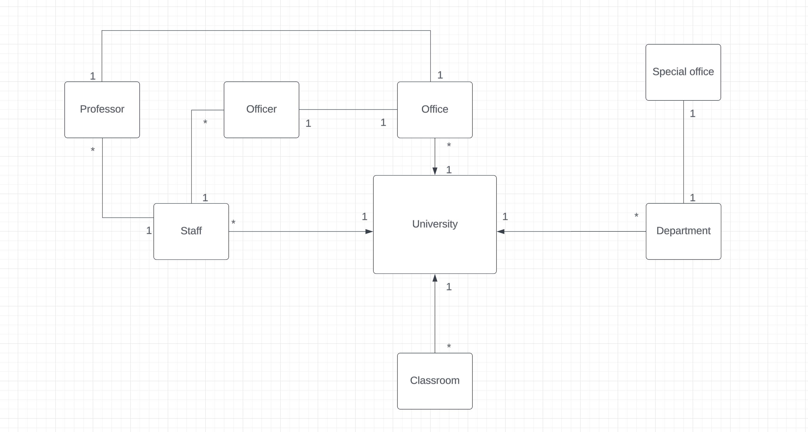

# University Management System

1. There are classrooms, working offices, and departments belonging to the university.
2. Departments have their own offices.
3. There are employees affiliated with the university. These employees can be professors or staff members.
4. Each employee works in an office.
